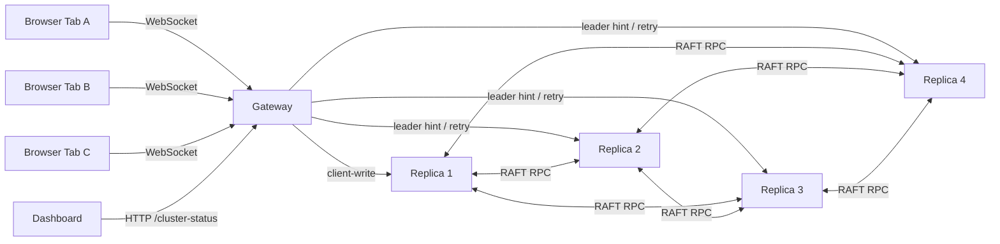
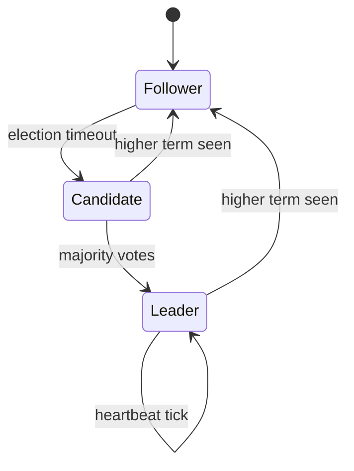

# Mini-RAFT Architecture Document

## System Summary
- What it does:
  - Provides a distributed real-time drawing board where all users see a consistent shared canvas.
  - Uses a Mini-RAFT replica cluster for leader election, log replication, and fault-tolerant commits.
- How it works:
  - Browser clients connect to the gateway through WebSocket.
  - The gateway forwards drawing and compensation events to the RAFT leader.
  - The leader replicates log entries to followers and commits on quorum.
  - Only committed state is exposed back to clients.
- API endpoints:
  - Gateway: `GET /health`, `GET /cluster-status`, WebSocket `/ws`.
  - Replica: `POST /request-vote`, `POST /append-entries`, `POST /heartbeat`, `POST /sync-log`, `POST /client-write`, `GET /health`, `GET /status`, `GET /board-state`.
- Configuration:
  - `RAFT_PEERS`, `REPLICA_ID`, `PORT`, `PEERS`, `MAX_USERS_PER_BOARD`, `VITE_WS_URL`, `VITE_GATEWAY_HTTP_URL`.

## Cluster Diagram

## RAFT-Lite Protocol Design

### Node States And Transitions
- What it does:
  - Enforces a single active leader per term and deterministic failover.
- How it works:
  - Follower waits for heartbeats.
  - Candidate starts election after timeout and requests votes.
  - Leader sends periodic heartbeats and performs replication.

- API endpoints:
  - `POST /request-vote`
  - `POST /heartbeat`
- Configuration:
  - Election timeout random 500-800ms.
  - Heartbeat interval 150ms.

### Log Replication And Commit
- What it does:
  - Replicates stroke events and commits on quorum before they become visible state.
- How it works:
  - Gateway submits event to current leader via `/client-write`.
  - Leader appends locally, sends AppendEntries to peers, tracks `nextIndex` and `matchIndex`.
  - Commit index advances only when majority has replicated current-term entries.
- API endpoints:
  - `POST /append-entries`
  - `POST /client-write`
- Configuration:
  - Majority dynamically computed from peer count (works for 3 or 4 replicas).

### Catch-Up And Sync Protocol
- What it does:
  - Brings restarted or lagging followers back to committed cluster state.
- How it works:
  - Followers reject mismatched AppendEntries and return current log length.
  - Leader adjusts follower `nextIndex` and proactively syncs committed entries.
  - `/sync-log` returns committed entries only from index `N` onward.
  - Follower catch-up applies only committed entries and updates `commitIndex`/`lastApplied`.
- API endpoints:
  - `POST /sync-log`
- Configuration:
  - Sync starts from follower-reported length + 1.

## RPC Definition

### RequestVote
- Request:
  - `term`, `candidateId`, `lastLogIndex`, `lastLogTerm`
- Response:
  - `term`, `voteGranted`, `responderId`

### AppendEntries
- Request:
  - `term`, `leaderId`, `prevLogIndex`, `prevLogTerm`, `entries[]`, `leaderCommit`
- Response:
  - `term`, `success`, `responderId`, `currentLogLength`

### Heartbeat
- Request:
  - `term`, `leaderId`, `leaderCommit`
- Response:
  - `term`, `success`, `responderId`

### SyncLog
- Request:
  - `fromIndex`, `term`, `leaderId`
- Response:
  - `term`, `entries[]` (committed only), `commitIndex`

### ClientWrite
- Request:
  - `stroke` (event payload)
- Response:
  - `success`, optional `leaderHint`

## Frontend And Gateway Event Model

### Collaborative Canvas And Failover UX
- What it does:
  - Renders local and remote strokes, supports reconnect, and preserves UX during leader failover.
- How it works:
  - `useWebSocket` reconnects with exponential backoff.
  - `useBoard` keeps optimistic local writes and tracks pending events.
  - On retryable RAFT write failure, pending optimistic state is rolled back using `strokeId`.
- API endpoints:
  - WebSocket messages: `join`, `stroke`, `join_ack`, `stroke_broadcast`, `user_joined`, `user_left`, `error`.
- Configuration:
  - `RECONNECT_BASE_DELAY`, `RECONNECT_MAX_DELAY`, `VITE_WS_URL`.

### Undo/Redo As Compensation Entries
- What it does:
  - Supports vector undo/redo without mutating committed log history.
- How it works:
  - Normal draw event: `action=stroke`.
  - Undo event: `action=undo_stroke`, `targetStrokeId=<id>`.
  - Redo event: `action=redo_stroke`, `targetStrokeId=<id>`.
  - Replica and gateway board state engines apply compensation by filtering/restoring visible strokes.
- API endpoints:
  - Sent through existing `stroke` message and replicated via `/client-write`.
- Configuration:
  - No extra env vars required.

## Dashboard And Observability
- What it does:
  - Provides a cluster status dashboard with leader, term, state, commit index, log length, and health.
- How it works:
  - Gateway aggregates replica `/health` and `/status` into `/cluster-status`.
  - Frontend dashboard polls gateway endpoint and renders table view.
- API endpoints:
  - `GET /cluster-status`
  - `GET /health`
- Configuration:
  - `VITE_GATEWAY_HTTP_URL`

## Docker Deployment And Hot Reload
- What it does:
  - Runs 1 gateway + 4 replicas + frontend with bind mounts and service health ordering.
- How it works:
  - Services run in dev watch mode (`tsx watch` / Vite dev).
  - Replica wrapper folders (`replica1/`, `replica2/`, `replica3/`, `replica4/`) are mounted.
  - Healthchecks gate startup via `depends_on: condition: service_healthy`.
  - Debug ports are exposed for troubleshooting.
- API endpoints:
  - Health endpoints used by Compose checks.
- Configuration:
  - Docker compose env for replica IDs, peer URLs, debug options, and frontend vars.

## Failure Handling Design
- Leader crash:
  - Followers time out, election runs, new leader forms, gateway retries writes.
- Split vote:
  - Candidate remains candidate, election timer resets, retry occurs on next timeout.
- Follower mismatch:
  - Committed-entry conflict is rejected; committed log entries are never overwritten.
- Restarted empty follower:
  - Catch-up sync replays committed entries from leader.
- Temporary no-leader window:
  - Gateway uses bounded retry/backoff; frontend rolls back failed optimistic writes.
- Network partition:
  - Demo script disconnects/reconnects container from Docker network and captures status/log artifacts.

## Demo And Artifact Workflow
- Automated failover script:
  - `scripts/test-failover.sh` executes election, leader kill, write after failover, restart catch-up, and captures logs into `logs/`.
- Automated partition script:
  - `scripts/test-network-partition.sh` isolates a replica, captures status before/during/after partition, and stores logs.
- Manual demo sequence:
  - Open multiple tabs, draw, kill leader, observe dashboard, edit mounted source for hot reload, verify catch-up consistency.

## Limitations And Cloud Note
- Real cloud VM deployment was not automated in this repository.
- If card-backed VM provisioning is restricted, the practical alternative is local Docker demo plus public tunnel/edge exposure for temporary remote access.
