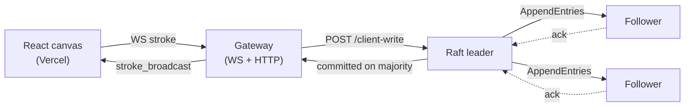

# Mini-RAFT

A deployed, fault-tolerant, real-time collaborative drawing board whose write path is a
**hand-rolled Raft consensus cluster** — leader election, a crash-durable replicated log, and
majority commit — written from scratch in TypeScript. A stroke becomes visible only after it is
**committed by a majority** of replicas.

Not a toy: it's crash-durable (WAL + snapshots, fsynced before every dependent RPC reply),
serves correct reads (ReadIndex), is observable (Prometheus `/metrics`), auth-gated, benchmarked,
and runs at a public URL on free-tier cloud.

- **Design defense** — the hard Raft questions answered from code: [`DEFENSE.md`](DEFENSE.md)
- **Every non-trivial decision, with rationale**: [`DECISIONS.md`](DECISIONS.md)
- **Deep protocol notes**: [`Documentation.md`](Documentation.md)
- **Build plan + acceptance gates**: [`PROJECT_PLAN.md`](PROJECT_PLAN.md)

---

## Architecture



**Write path:** frontend `stroke` over WebSocket → gateway routes it to the current leader's
`/client-write` → leader appends, replicates via AppendEntries, commits once a majority acks →
gateway broadcasts the committed stroke to the board's clients. A stroke that never reaches
majority is never broadcast.

**Read/join path:** client `join` → gateway fetches board state from the leader's `/board-state`,
which serves only after a **ReadIndex** leadership confirmation (a minority-partitioned leader
returns `421` + a redirect instead of a stale view) → gateway replies `join_ack` with the strokes.

Three services, kept separate: `frontend/` (React + Vite), `gateway/` (Node `http`/`ws`),
`replica/` (the Raft node — log/persistence, state machine, RPC, timers, transport as modules).

---

## Benchmarks

Measured by the zero-dependency harness in [`benchmarks/`](benchmarks/README.md)
(`node benchmarks/bench.mjs <load|failover>`), driving committed writes directly at the leader's
`/client-write` (which replies only after majority commit). Raw result files with full params live
in [`benchmarks/results/`](benchmarks/results/).

| Metric | Local (Docker Desktop) | Live GCP `e2-small` |
|---|---|---|
| Committed writes/s | ~40–41 | **79.0** |
| Commit latency p50 | ~388 ms | **197 ms** |
| Commit latency p99 | ~504–548 ms | **304 ms** |
| Automatic leader failover | 3.36 s | 3.36 s |

Workload: `writes=500 concurrency=16`, single client process (not a hardware ceiling). GCP shape:
`e2-small` (2 vCPU Xeon @2.2GHz, 1.9 GB RAM), Node 20. Failover time is dominated by the 500–800 ms
election-timeout window plus the harness's own 500 ms polling granularity, not raw RPC cost.
Local numbers reproduce across back-to-back runs (the L8 gate requirement).

> **Résumé line:** *Built a crash-durable Raft cluster in TypeScript (WAL + snapshots) backing a
> real-time collaborative canvas: **79 committed writes/s**, **p99 304 ms** commit latency,
> automatic leader failover in **~3.4 s** across a 3-node cluster; deployed on free-tier cloud.*

---

## Raft properties implemented (and where they live)

Full walkthrough with `file:line` citations in [`DEFENSE.md`](DEFENSE.md). In brief:

- **Leader election** with randomized timeouts (500–800 ms) + split-vote retry
- **Crash-durable state** — `currentTerm`/`votedFor`/log fsynced *before* any dependent RPC reply
- **Majority commit** with the **current-term commit rule** (Figure-8 safety, §5.4.2)
- **Log consistency check** + truncate-on-conflict, committed entries protected from overwrite
- **Snapshots & log compaction** (bounded log, InstallSnapshot RPC for far-behind followers)
- **Correct reads** via ReadIndex (no stale reads on a partitioned leader)
- **Backpressure** — AppendEntries batch cap + a single coalesced replication driver per peer

Each ships with a test that fails if the property breaks (see the map at the bottom of `DEFENSE.md`).

---

## Quick start (Docker)

```bash
docker compose up --build -d
docker compose ps
```

- Frontend: `http://localhost:5173` · Dashboard: `http://localhost:5173/dashboard`
- Gateway health: `http://localhost:8080/health` · Cluster status: `http://localhost:8080/cluster-status`
- Replicas: `http://localhost:3001..3003`

```bash
docker compose down   # stop everything
```

Auth is gateway-only; set `AUTH_TOKEN` in the compose env to require a bearer token on
`/cluster-status` and a `?token=` on the WebSocket (`/health` stays open for liveness).

## Local development (without Docker)

Run each service in its own terminal.

```bash
# replica/  — three nodes
REPLICA_ID=replica1 PORT=3001 PEERS="http://localhost:3002,http://localhost:3003" npm run dev
REPLICA_ID=replica2 PORT=3002 PEERS="http://localhost:3001,http://localhost:3003" npm run dev
REPLICA_ID=replica3 PORT=3003 PEERS="http://localhost:3001,http://localhost:3002" npm run dev

# gateway/
RAFT_PEERS="http://localhost:3001,http://localhost:3002,http://localhost:3003" npm run dev

# frontend/
npm run dev
```

`npm install` once per service first. Frontend env: `VITE_WS_URL` (default
`ws://localhost:8080/ws`), `VITE_GATEWAY_HTTP_URL` (default `http://localhost:8080`),
`VITE_AUTH_TOKEN` (must match the gateway's `AUTH_TOKEN` when auth is on).

---

## Deployment

The cluster runs at a public URL on free-tier cloud (currently GCP `e2-small` on the 90-day free
trial; Oracle Always Free is the documented alternative). Public HTTPS/WSS entry is via a
Cloudflare Tunnel; the frontend is on Vercel. **Full runbook, step by step:**
[`DEPLOY.md`](DEPLOY.md) — provision the VM, build/push images, create the tunnel, fill `.env`,
`scripts/deploy-up.sh`, deploy the frontend, then verify the live gate (public write, remote
failover, reboot survival).

> The deployment uses a token-free Cloudflare **quick tunnel**, whose `*.trycloudflare.com`
> hostname changes on restart — so no live URL is hardcoded here; get the current one from the
> VM as described in `DEPLOY.md`.

---

## HTTP / WebSocket API

**Gateway:** `GET /health`, `GET /cluster-status` (bearer auth), `WS /ws?boardId=&userId=&token=`.

**Replica:** `POST /request-vote` · `/append-entries` · `/heartbeat` · `/sync-log` ·
`/install-snapshot` · `/client-write`; `GET /health` · `/ready` · `/status` · `/metrics`
(Prometheus) · `/board-state?boardId=`.

**WS messages** — client→gateway: `join`, `stroke`. gateway→client: `join_ack`,
`stroke_broadcast`, `user_joined`, `user_left`, `error`. Same user may open multiple tabs on one
board; broadcast exclusion is per-socket so same-user tabs still see each other. Undo/redo are
compensation entries in the replicated log.

---

## Testing & demos

```bash
cd replica  && npm test   # 105 tests
cd gateway  && npm test   # 65 tests
cd frontend && npm test   # 41 tests
```

CI (`.github/workflows/ci.yml`) builds and tests all three on push/PR to `main`. Failure demos
write timestamped artifacts under `logs/`:

```bash
bash scripts/test-failover.sh
bash scripts/test-network-partition.sh
```

---

## Tradeoffs & honest caveats

- **Single-VM, co-located cluster.** The 3 replicas + gateway run as containers on one VM — this
  proves the consensus protocol, not geo-distributed fault tolerance. A real deployment would
  spread replicas across failure domains.
- **Hand-rolled, not battle-tested.** Written to *demonstrate* each safety property from readable
  code (that's the point — see `DEFENSE.md`), not to compete with etcd/raft at scale.
- **No dynamic membership.** Joint-consensus reconfiguration, multi-Raft sharding, and
  geo-replication are acknowledged next steps, not implemented (`PROJECT_PLAN.md` §9).
- **No inter-replica TLS.** RPC between replicas is plaintext on a trusted network; auth is
  enforced at the gateway edge only. The gateway `AUTH_TOKEN` is coarse admission control (baked
  into the public bundle), not a per-user secret — there is no account model.
- **Ephemeral public URL.** The token-free Cloudflare quick tunnel gets a new hostname on restart
  (a deliberate free-tier choice; a named tunnel with a domain removes this — see `DECISIONS.md`).
- **Read freshness bound.** A freshly-elected leader's `commitIndex` can briefly lag until its
  first current-term commit — never wrong data, self-healing (`DECISIONS.md` D13).

## Prerequisites

Node.js 20+, npm, Docker + Docker Compose (for the cluster), Bash (Git Bash on Windows is fine).
